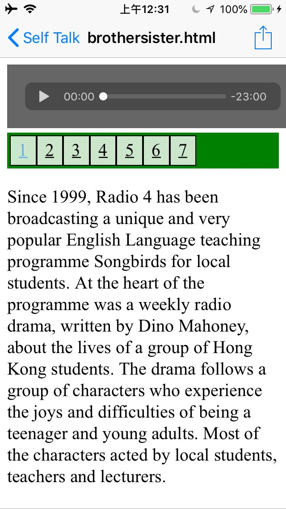

# audioplayer
To demonstrate the usage of the AudioPlayer, a playlist is taken from [Song Birds by Radio 4 Hong Kong](http://rthk9.rthk.hk/radiodrama/12songbirds/songbirds.htm) as an example.

AudioPlayer is a mobile first responsive single html5 page with the following features :
* auto play a playlist of audio files or urls from any selected sequel.

```html
    <audio id="audio" preload="auto" tabindex="0" controls="" type="audio/mpeg">
        <source type="audio/mp3" src="http://rthk9.rthk.hk/radiodrama/mp3/12songbirds/brother01.mp3">
        Sorry, your browser does not support HTML5 audio.
    </audio>
<div id="playlist">
<div class="active"><a href="http://rthk9.rthk.hk/radiodrama/mp3/12songbirds/brother01.mp3">1</a></div>
<div><a href="http://rthk9.rthk.hk/radiodrama/mp3/12songbirds/brother02.mp3">2</a></div>
<div><a href="http://rthk9.rthk.hk/radiodrama/mp3/12songbirds/brother03.mp3">3</a></div>
<div><a href="http://rthk9.rthk.hk/radiodrama/mp3/12songbirds/brother04.mp3">4</a></div>
<div><a href="http://rthk9.rthk.hk/radiodrama/mp3/12songbirds/brother05.mp3">5</a></div>
<div><a href="http://rthk9.rthk.hk/radiodrama/mp3/12songbirds/brother06.mp3">6</a></div>
<div><a href="http://rthk9.rthk.hk/radiodrama/mp3/12songbirds/brother07.mp3">7</a></div>
</div>
```
To style the content of player and the playlist, we need the inline css
```html
<style>
p , pre  {font-size: 20px;}    
#audio{background:#666;width:94%;padding:20px;}
.active a{color:#5DB0E6;text-dcoration:none;}
div a{color:black;}
div a:hover{text-decoration:none;}
#playlist {
  display: grid;
  grid-template-columns: 1fr 1fr 1fr 1fr 1fr 1fr 1fr 1fr 1fr 1fr;
  background-color: green;
  padding: 3px;
}
#playlist > div  {
  background-color: rgba(255, 255, 255, 0.8);
  border: 1px solid black;
  padding: 4px;
  text-align: center;
  font-size: 20px;
}
</style>
```
To implement the autoplay from any sequel, we need the following vanilla javascript
```javascript
var audio;
var playlist;
var tracks;
var current;
if (document.readyState !== 'loading' ) {
  eventHandler();
} else {
  document.addEventListener( 'DOMContentLoaded', eventHandler);  
}  
function eventHandler(){

init();
function init(){
    audio = document.getElementById('audio');
    playlist = document.getElementById('playlist');
    current = playlist.firstElementChild;
    tracks = playlist.querySelectorAll('a');
    audio.volume = .10;
    audio.play();
    for (var link of tracks) {
        link.addEventListener('click', function(e){ 
        e.preventDefault();
        var link = this;
        current.classList.remove('active');
        current = link.parentNode;
        current.classList.add('active');
        run(link, audio);
        });
    }
    audio.addEventListener('ended',function(e){
        current.classList.remove('active');
        current= current.nextElementSibling;
        if(current == null){
            current = playlist.firstElementChild;
        }
        current.classList.add('active');
        link = current.firstElementChild;
        run(link,audio);
    });
}
function run(link, player){
        player.src = link.href;
        audio.load();
        audio.play();
}
}	
```
---
___

Here is the screenshot when the end-product [brothersister.html](brothersister.html) is whatsapped and run in an iPhone :

---
___
This [AudioPlayer Template](indexTemplate.html) is able to accommodate a playlist of 100 episode Cantonese radio drama [Mount Deer](rthk_radiodrama/鹿鼎記.html) adapted from the [original](http://rthk9.rthk.hk/radiodrama/5martial/mountdeer.htm) of [RTHK Hong Kong](http://www.rthk.hk/?lang=en). 
